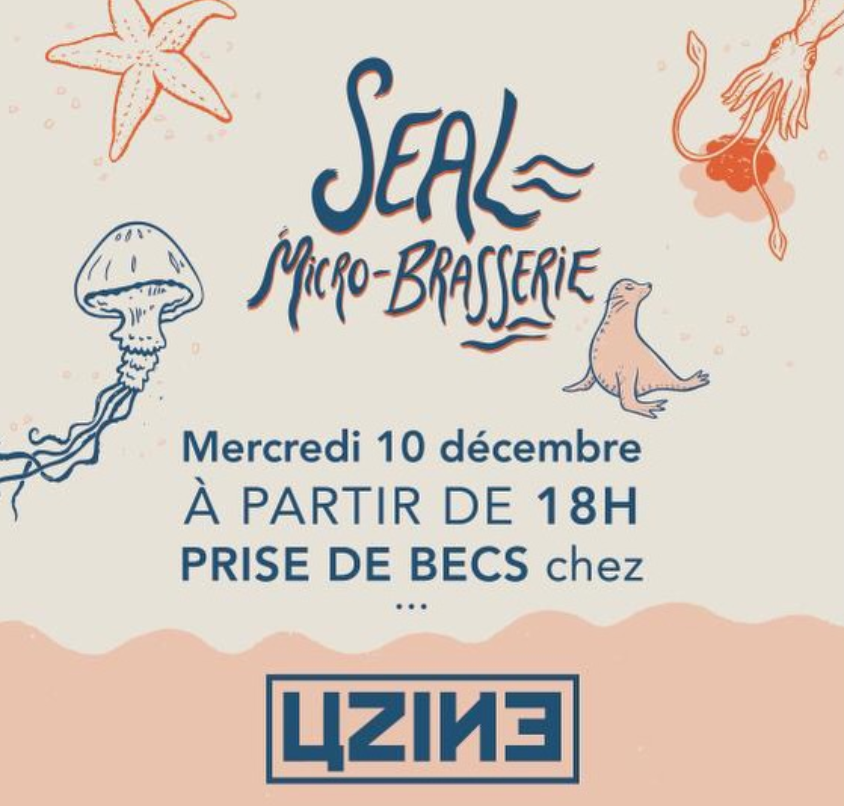
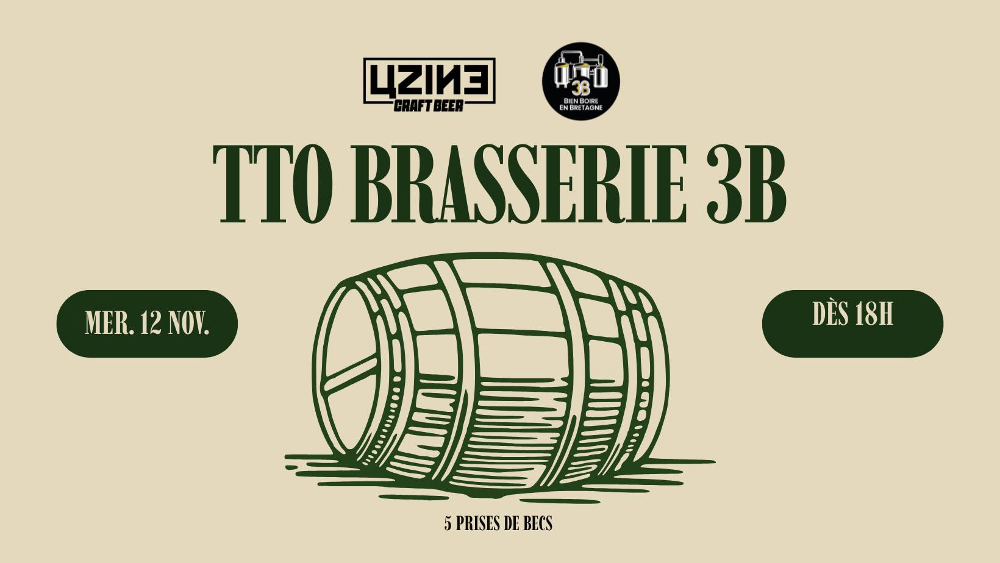
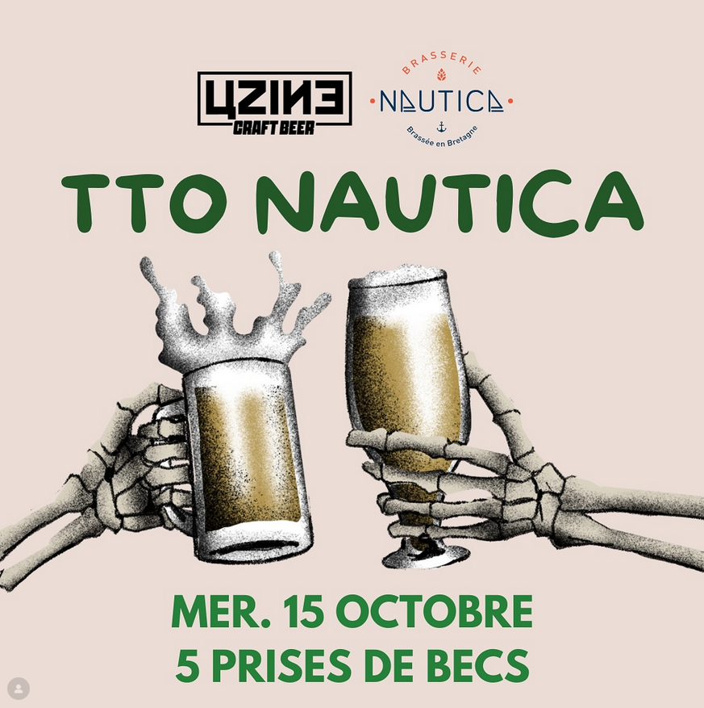
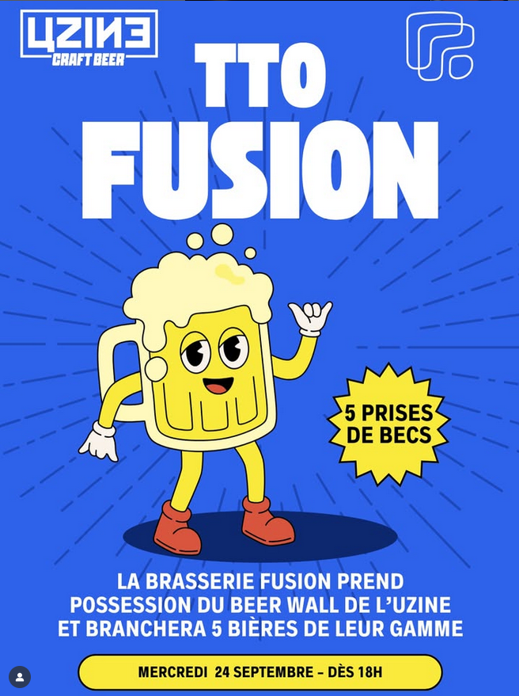
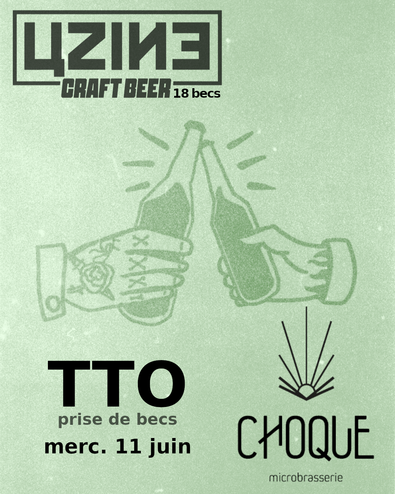

# Uzine bar (in Rennes): 18 beers on tap !

* Uzine pils, 5% (FR)
* Louarn "boum boum" Double IPA, 7,2% (BZH)
* Louarn "bombarde" IPA, 5,5% (BZH)
* Louarn "fanfare" NEIPA, 6% (BZH)
* Louarn "jam "session IPA, 5% (BZH)
* Louarn "räve" hoppy wheat - blanche, 4,5% (BZH)
* Louarn "hipnoz" pale ale, 5% (BZH)
* Nautica "Titanic" triple, 8,5% (BZH)
* Slash Red, 8% (FR)
* Ste Colombe dorée, 5% (BZH)
* Duchesse Anne "Hops", 6,9% (BZH)
* Guinness Stout, 4,2% (IRL)
* Cidre pression, 4,5% (BZH)
* Bouteilles et cannettes: Guinness 0%, Brooklyn 0%, Dremwell 0%, ...

+ 5 becs craft tournants tous les mois:

## Wednesday TTOs !
Tap take overs by local craft brewers

* 16/09/26 TTO by L'écume sauvage [insta](https://www.instagram.com/brasserie_lecume_sauvage/)
  * 𝗙𝗔𝗖𝗘 𝗔̀ 𝗟’𝗔𝗠𝗘𝗥 : IPA (5 %)
  * 𝗟𝗘 𝗩𝗘𝗡𝗧 𝗦𝗢𝗨𝗙𝗙𝗟𝗘 𝗦𝗨𝗥 𝗟𝗘𝗦 𝗣𝗟𝗔𝗜𝗡𝗘𝗦 : DDH Session NEIPA (3,7%)
  * 𝗔𝗨 𝗕𝗢𝗨𝗧 𝗗𝗘 𝗟𝗔 𝗡𝗨𝗜𝗧 : Smoked Ale (7%)
  * 𝗟’𝗔𝗠𝗢𝗨𝗥 𝗔̀ 𝗟𝗔 𝗣𝗟𝗔𝗚𝗘 : DDH NEIPA (5,4%)
  * 𝗦𝗨𝗥 𝗧𝗔 𝗠𝗔𝗥𝗜𝗡𝗜𝗘̀𝗥𝗘 : Ambré à la galette de sarrasin (4,7%)

* 20/05/26 TTO by Horla [Insta](https://www.instagram.com/microbrasseriehorla/)
  * COLLAB AVEC KAURI : West Coast IPA (6,2 %)
  * SAISON DE PRINTEMPS : Grisette aux baies de Sichuan (4%)
  * RESSAC : Gose traditionnelle (4,3%)
  * SOUR ALE : Sour Citron/Gingembre) (4,5%)
  * CHERRY BOMB : Sour ale à la cerise (5,2%)

* 15/04/26 TTO by Brume [Insta](https://www.instagram.com/p/DW3Wo_EDBro/)
  * VALDRADE : Neipa (6%)
  * GNAGNAGNA : Imperial IPA (9,5%)
  * HASTA LA VISTA : IPA 100% Vista breton (4,5%)
  * BOIS VERMEIL : Amber Ale (6%)
  * BRUME DES FOINS : Pale Ale (5%)

* 18/03/26 TTO by Choque x Octa
  * VORTEX : Dark Sour (5%) bière collab' Octa/Choque
  * ARCUS³ : Triple IPA (10%)
  * SØLAR : Double NEIPA (7,5%)
  * ZINZIN : Gose Sarrasin (5,2%)
  * TWISTER : Double NZ IPA (7,5%)
  
* 04/02/26 TTO by [Torr Penn](https://brasserie-torrpenn.com/). 
  * RAINBOW : New Zealand IPA (5,8%)
  * COLLAB avec 90 BPM : Sour (4,7%)
  * DOUBLE NEIPA (7,3%)
  * WHEAT ALE (5%)
  * NEIPA au blé noir (5,5%)

* 14/01/26 TTO by [Alchimistes Ivres](https://www.alchimistes-ivres.com). 
  * ORENDIL : Hazy IPA (7,2%)
  * GULD'HOP : Session IPA (3,4%)
  * PÊCHER MORTEL : Pastry Sour Pêche et Poivre de Timut (4,1%)
  * East Coast IPA (5,3%)

* 10/12/25 TTO by [Seal](https://www.facebook.com/Microbrasserie.seal/).
  * MOKU MANA : American Wheat (4,5%)
  * SANTA BARBARA : IPA (6%)
  * GIVREON : Sour Poire Sarrasin (3,5%)
  * PUFF PUFF : Session NEIPA (5,5%)
  * DOUBLE IPA en Collab' avec Nautica (7%)

* 1 2/11/25 TTO by [3B](https://www.facebook.com/Les3BBar/).
   * CALIFORNIA SOUL : Cold IPA (6%)
  * WINTER TIME : Amber Ale (5%)
  * WOODSTOCK : Saison barriquée (7%)
  * RUBY TUESDAY : Ale Framboises Myrtilles (5,5%)
  * INDIAN SUMMER : Pale ale (5,5%)

* 15/10/25 TTO by [Nautica](https://www.instagram.com/p/DPgfNv8DLKT/).
  * Sloop: Pale Ale (4.8%)
  * Goelette: Double NEIPA (7%)
  * Lougre: Witbier Citronnelle (4.5%)
  * Plongée: Fruitée Gose Citron Mangue Poivre Blanc (5%)
  * Belgian: triple (8%)

* 24/09/25 TTO by [Fusion](https://www.instagram.com/fusionbrasserie_/?hl=en).
  * NZ Cold IPA
  * Australian NEIPA
  * Sour Pêche/Mûre/Myrtille
  * Sour Gingembre/Clémentine/Vanille
  * Blanche IPA

* 11/06/25 TTO by [Choque](https://www.choquemicrobrasserie.fr/).
  * Echo (sour IPA)
  * Houle (Gose kombu sichuan)
  * Coup double (belgian dubbel)
  * Cassis surprise (blanche cassis)
  * Fracas (west coast ipa)  

## More

-> free wifi / plugs / usb plugs

https://uzine.bar/

