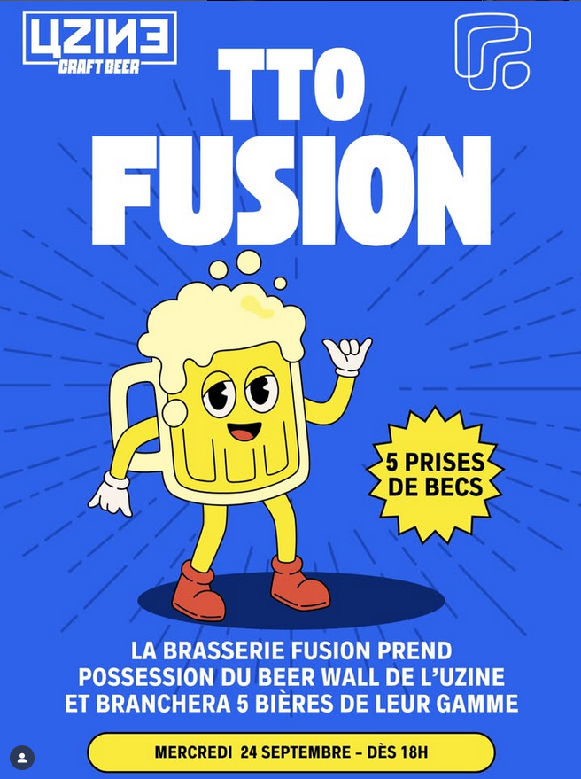

# Uzine bar (in Rennes): 18 beers on tap !

* Uzine pils (FR)
* Louarn Double IPA (BZH)
* Louarn IPA (BZH)
* Louarn NEIPA (BZH)
* Louarn session IPA (BZH)
* Louarn hoppy wheat (BZH)
* Louarn pale ale (BZH)
* Bouffay ambrée (BZH)
* O'hara's stout (IRL)
* Slash Red (FR)
* Ste Colombe dorée (BZH)
* Duchesse Anne Hops (BZH)
* Lupulus triple (BEL)
* cidre pression (BZH)
* Bouteilles: Brooklyn 0%, Dremwell 0%, ...

## Wednesday TTOs !
Tap take overs by local craft brewers

* 15/10/25 TTO by [Nautica](https://www.instagram.com/p/DPgfNv8DLKT/).
  * Sloop: Pale Ale (4.8%)
  * Goelette: Double NEIPA (7%)
  * Lougre: Witbier Citronnelle (4.5%)
  * Plongée: Fruitée Gose Citron Mangue Poivre Blanc (5%)
  * Belgian: triple (8%)

* 24/09/25 TTO by [Fusion](https://www.instagram.com/fusionbrasserie_/?hl=en).
  * NZ Cold IPA
  * Australian NEIPA
  * Sour Pêche/Mûre/Myrtille
  * Sour Gingembre/Clémentine/Vanille
  * Blanche IPA

* 11/06/25 TTO by [Choque](https://www.choquemicrobrasserie.fr/).
  * Echo (sour IPA)
  * Houle (Gose kombu sichuan)
  * Coup double (belgian dubbel)
  * Cassis surprise (blanche cassis)
  * Fracas (west coast ipa)  

## More

-> free wifi / plugs / usb plugs

https://uzine.bar/

