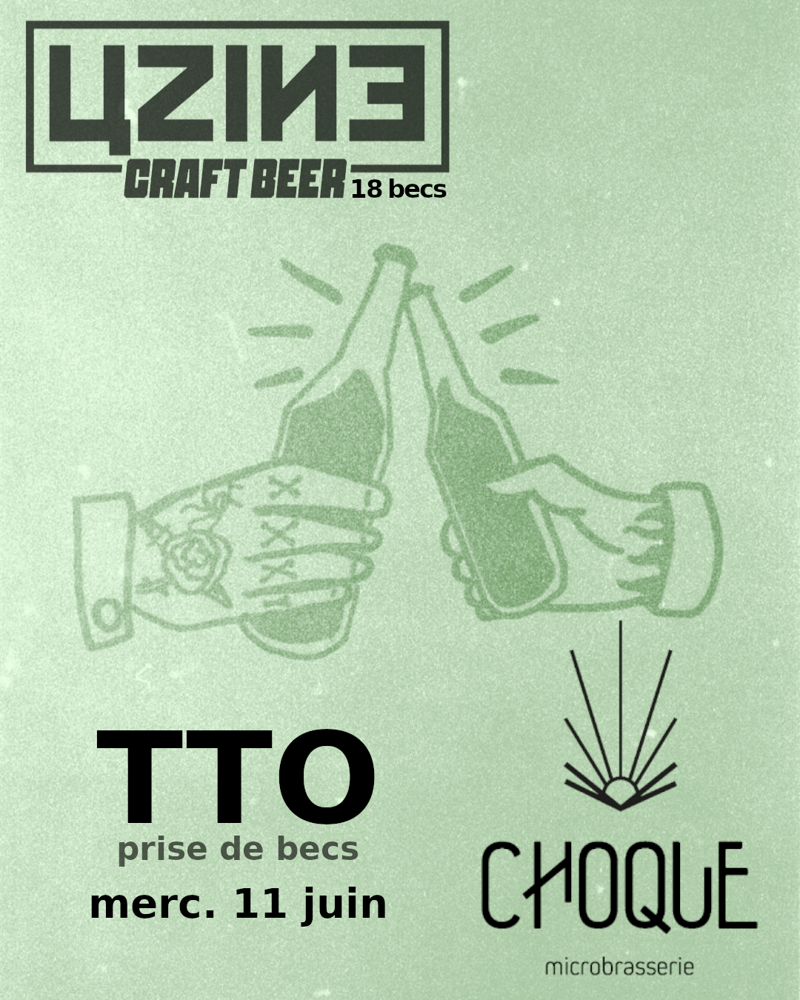

# Uzine bar (in Rennes): 18 beers on tap !

* Uzine pils (FR)
* Louarn Double IPA (BZH)
* Louarn IPA (BZH)
* Louarn NEIPA (BZH)
* Louarn session IPA (BZH)
* Louarn hoppy wheat (BZH)
* Louarn pale ale (BZH)
* Nautica/Louarn ambrée tonka (BZH)
* Nautica triple (BZH)
* Slash Red (FR)
* Ste Colombe dorée (BZH)
* Duchesse Anne Hops (BZH)
* Guinness (IRL)
* cidre pression (BZH)
* Bouteilles: Brooklyn 0%, Dremwell 0%, ...

## Wednesday TTOs !
Tap take overs by local craft brewers

* 04/02/26 TTO by [Torr Penn](https://brasserie-torrpenn.com/). 
  * RAINBOW : New Zealand IPA (5,8%)
  * COLLAB avec 90 BPM : Sour (4,7%)
  * DOUBLE NEIPA (7,3%)
  * WHEAT ALE (5%)
  * NEIPA au blé noir (5,5%)

* 14/01/26 TTO by [Alchimistes Ivres](https://www.alchimistes-ivres.com). 
  * ORENDIL : Hazy IPA (7,2%)
  * GULD'HOP : Session IPA (3,4%)
  * PÊCHER MORTEL : Pastry Sour Pêche et Poivre de Timut (4,1%)
  * East Coast IPA (5,3%)

* 10/12/25 TTO by [Seal](https://www.facebook.com/Microbrasserie.seal/).
  * MOKU MANA : American Wheat (4,5%)
  * SANTA BARBARA : IPA (6%)
  * GIVREON : Sour Poire Sarrasin (3,5%)
  * PUFF PUFF : Session NEIPA (5,5%)
  * DOUBLE IPA en Collab' avec Nautica (7%)

* 1 2/11/25 TTO by [3B](https://www.facebook.com/Les3BBar/).
   * CALIFORNIA SOUL : Cold IPA (6%)
  * WINTER TIME : Amber Ale (5%)
  * WOODSTOCK : Saison barriquée (7%)
  * RUBY TUESDAY : Ale Framboises Myrtilles (5,5%)
  * INDIAN SUMMER : Pale ale (5,5%)

* 15/10/25 TTO by [Nautica](https://www.instagram.com/p/DPgfNv8DLKT/).
  * Sloop: Pale Ale (4.8%)
  * Goelette: Double NEIPA (7%)
  * Lougre: Witbier Citronnelle (4.5%)
  * Plongée: Fruitée Gose Citron Mangue Poivre Blanc (5%)
  * Belgian: triple (8%)

* 24/09/25 TTO by [Fusion](https://www.instagram.com/fusionbrasserie_/?hl=en).
  * NZ Cold IPA
  * Australian NEIPA
  * Sour Pêche/Mûre/Myrtille
  * Sour Gingembre/Clémentine/Vanille
  * Blanche IPA

* 11/06/25 TTO by [Choque](https://www.choquemicrobrasserie.fr/).
  * Echo (sour IPA)
  * Houle (Gose kombu sichuan)
  * Coup double (belgian dubbel)
  * Cassis surprise (blanche cassis)
  * Fracas (west coast ipa)  

## More

-> free wifi / plugs / usb plugs

https://uzine.bar/

